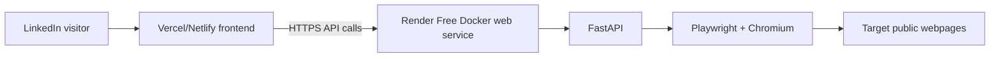

# Hosting options for Ditto

Ditto has two distinct deployment needs:

1. **Frontend:** Next.js app. Best hosted as static/edge/serverless frontend on a web platform.
2. **Backend:** FastAPI API that uses Playwright/Chromium scraping. This needs a Linux container or VM with enough memory, writable ephemeral disk, outbound network access, and browser system dependencies. It is not a good fit for edge functions.

Research date: 2026-09-09. Do not rely on this for production pricing without rechecking the linked pricing pages.

## Short recommendation

For a LinkedIn portfolio demo with no spend:

- **Best no-cost split architecture:** deploy the **frontend on Vercel Hobby or Netlify Free**, and the **FastAPI + Playwright backend as a Docker web service on Render Free**.
- **Why:** Vercel/Netlify are reliable for Next.js demos, while Render Free is one of the few no-upfront-cost platforms that still supports normal Docker web services. Render explicitly supports Docker and free web services, but it spins down after 15 minutes idle and cold starts take about one minute.
- **Demo caveat:** LinkedIn visitors may hit a cold backend and wait. Add a frontend loading message such as “starting demo backend, this can take about a minute.”
- **Most robust truly-free alternative:** **Oracle Cloud Always Free VM** can run Docker/Playwright continuously, but signup frequently requires billing identity verification, availability can be frustrating, and it is much more ops-heavy than a portfolio demo needs.
- **Avoid for the Playwright backend:** Cloudflare Workers/Pages Functions, Vercel Functions, Netlify Functions, and other edge/serverless functions. Chromium is too large/heavy and needs a real container/VM.

Recommended architecture:

## Comparison

| Platform | Free/no-cost reality | Docker/Playwright fit | Sleep/cold start | Limits and reliability notes | Verdict for Ditto |
|---|---|---:|---|---|---|
| **Render Free** | Hobby workspace is $0 plus free compute. Free web services get 750 free instance-hours/month. No payment method means services suspend instead of billing when included limits are exhausted. | **Good.** Render supports custom Docker builds and OS-level packages. Free instance is 512 MB RAM and less than 1 CPU, so Chromium may need careful memory flags and low concurrency. | Sleeps after 15 minutes idle. Spin-up takes about one minute. | Free filesystem is ephemeral. Free services can restart anytime. Free Postgres expires after 30 days. High service-initiated traffic can be suspended. | **Best portfolio backend choice if free PaaS is required.** Use Docker, one worker, visible cold-start UX. |
| **Vercel Hobby** | $0 Hobby plan for personal projects. Includes 100 GB Fast Data Transfer, 1M Edge Requests, included function/ISR/blob quotas. | **Frontend only.** Excellent Next.js hosting. Serverless functions are not a good place for bundled Chromium scraping. | Frontend is effectively always available. Serverless functions may cold start. | Hobby is intended for personal projects. Watch usage and fair-use terms. | **Use for frontend.** Point `NEXT_PUBLIC_API_BASE_URL` at backend. |
| **Netlify Free** | $0 forever plan with 300 monthly credits. Credits cover deploys, bandwidth, web requests, functions/compute, etc. | **Frontend only.** Good static/Next frontend host. Not appropriate for long-running Chromium scraping in functions. | CDN frontend is fast. Functions may cold start. | 300 credits can be used by deploys, bandwidth, requests, and compute. Auto-recharge is optional and should stay disabled for no-spend. | **Good frontend alternative** if Vercel is not desired. |
| **Cloudflare Pages + Workers Free** | Pages Free has 500 builds/month, 20 minute build timeout, 20k files. Workers Free has 100k requests/day. | **Poor for backend.** Workers have 128 MB memory and 10 ms CPU time on Free, which is incompatible with Chromium. Pages is good for static frontend only. | No traditional sleeps for edge/static. | Great reliability for static content and lightweight APIs. Not a container host. | **Frontend/static only.** Do not put Playwright backend here. |
| **Google Cloud Run** | Has a monthly free tier, for example first 240k vCPU-seconds and 450k GiB-seconds for instance-based billing. Usually requires a Google Cloud billing account/credit card. | **Strong technically.** Any Linux x86_64 container image that follows Cloud Run’s container contract can run, including Playwright. | Scales to zero by default, so cold starts happen. Minimum instances cost money. Startup must listen within 4 minutes. | Highly reliable, but accidental spend is possible without budgets/alerts. Free tier is usage-based, not a simple “free forever app.” | **Best technical serverless container option if a billing account is acceptable.** Not ideal for “no card, no spend.” |
| **Railway Free** | Pricing page says Free starts with a 30-day trial with $5 credits, then $1/month. No credit card required for trial. | **Good technically.** Supports Dockerfile deployment. 0.5 GB RAM after trial may be tight for Chromium. | Depends on app configuration and credits. | Not genuinely free forever after trial. Free trial has resource/project limits. | **Do not recommend for no-cost portfolio unless accepting a trial only.** |
| **Fly.io** | Usage-based pricing. Official docs say all organizations, except linked organizations, require a credit card on file. | **Excellent technically.** Full containers/machines and can run Playwright. | Machines can be stopped/autostarted, but stopped rootfs storage is still billed. | Requires credit card and careful cost controls. | **Great paid/starter option, not a no-card free choice.** |
| **Koyeb** | Current pricing emphasizes paid Pro at $29/month plus compute and paid serverless/GPU compute. A historical free web-service tier is not clearly present on current pricing. | **Good technically when paid.** Container/serverless compute can run Docker apps. | Scale-to-zero available. | Free option is not obvious for this use case in current docs. | **Not recommended as a genuinely free backend today.** |
| **Hugging Face Spaces** | Static Spaces are free. Gradio/Docker Spaces on compute require a paid plan to create, except limited ZeroGPU Gradio. CPU Basic hardware is free once eligible, but Docker compute creation requires paid plan. | **Potentially good technically for Docker, but paid-plan gated.** | Spaces can sleep/rebuild and are optimized for ML demos, not general APIs. | Public-by-default source/app model may be awkward for product demos. | **Not recommended for this backend unless already paying for HF Pro.** |
| **Replit Starter** | Free Starter includes “Publish 1 live project” and one background task. | **Possible for demos, uncertain for Playwright reliability.** Browser dependencies and always-on behavior may be constrained. | Free projects may not provide production-style always-on reliability. | Great for quick experiments, weaker as a public LinkedIn demo backend. | **Acceptable prototype fallback, not primary recommendation.** |
| **Oracle Cloud Always Free** | Always Free services continue indefinitely after the 30-day/$300 trial. Includes AMD and Arm compute, storage, networking, etc. Signup requires accurate billing/contact info and idle accounts may be suspended. | **Strong if using a VM.** Install Docker and run Playwright yourself. Arm instances may require arm64-compatible images. | No PaaS sleep if VM remains active, but idle account policies matter. | More setup, maintenance, security patching, firewalling, and capacity availability issues. | **Most capable no-monthly-cost path, but high ops burden.** Use only if Render Free is too slow or too small. |

## Practical deployment notes

### Frontend

Use Vercel Hobby or Netlify Free for the Next.js app.

- Configure a public API base URL, for example `NEXT_PUBLIC_API_BASE_URL=https://ditto-api.onrender.com`.
- Keep any secrets out of frontend environment variables.
- Add user-facing loading/error copy for backend cold starts.

### Backend

Use a single Dockerized FastAPI service on Render Free first.

Suggested operational constraints for free hosting:

- Run one Uvicorn worker.
- Limit scraping concurrency to one browser/page at a time.
- Use a Playwright Docker base image or install Playwright system dependencies in the Dockerfile.
- Prefer request timeouts and clear frontend messaging over background jobs.
- Treat the filesystem as ephemeral. Do not store important scraped output locally.
- Add a cheap `/health` endpoint for the frontend to test whether the backend is awake.

### If Render Free cannot run Chromium reliably

Move only the backend to one of these, in order:

1. **Google Cloud Run** if a billing account and strict budget alerts are acceptable.
2. **Oracle Cloud Always Free VM** if you want no monthly charge and can handle VM operations.
3. **Render Starter** if spending a small predictable monthly amount becomes acceptable.

## Evidence links

- Render pricing: <https://render.com/pricing>
- Render free service limitations: <https://docs.render.com/free>
- Render Docker support: <https://docs.render.com/docker>
- Vercel pricing: <https://vercel.com/pricing>
- Netlify pricing: <https://www.netlify.com/pricing/>
- Cloudflare Pages limits: <https://developers.cloudflare.com/pages/platform/limits/>
- Cloudflare Workers limits: <https://developers.cloudflare.com/workers/platform/limits/>
- Google Cloud Run pricing/free tier: <https://cloud.google.com/run/pricing>
- Google Cloud Run container contract: <https://cloud.google.com/run/docs/container-contract>
- Railway pricing: <https://railway.com/pricing>
- Fly.io pricing and billing requirements: <https://fly.io/docs/about/pricing/>
- Koyeb pricing: <https://www.koyeb.com/pricing>
- Hugging Face Spaces overview: <https://huggingface.co/docs/hub/spaces-overview>
- Replit pricing: <https://replit.com/pricing>
- Oracle Cloud Free Tier: <https://www.oracle.com/cloud/free/>
