# Ditto Portfolio Case Study

## Recruiter/founder hook

Ditto is an AI accessibility browser that rebuilds any webpage around the way a person reads. It turns a URL into a calmer, more navigable, student/user-specific page, then shows before/after accessibility evidence.

## Why this project is worth noticing

Most accessibility products either audit pages or apply shallow visual tweaks. Ditto attempts the harder product loop:

1. Ask how someone reads best.
2. Safely fetch an arbitrary page.
3. Classify whether the content is appropriate for the user's profile.
4. Rebuild the page into accessible HTML.
5. Score the original and rebuilt versions.
6. Let the user read, share, revisit, or use the flow from a browser extension.

That makes Ditto a full-stack product, not a prompt demo.

## What I built

- **Product surface:** onboarding, preferences, chat, batch transforms, output viewer, share links, recent history, settings, and Chrome Manifest V3 extension.
- **Backend:** FastAPI API with routers for transform, batch transform, chat, score, voice/TTS, sharing, profiles/history, health, maps, and agent actions.
- **AI pipeline:** Playwright/browser scrape with fallback, content safety classification, OpenAI HTML rebuild, before/after scoring, and Claude-backed action planning.
- **Accessibility personalization:** blind, low vision, dyslexia, deaf/hard-of-hearing, ADHD, tremor, elderly, children, and plain-language needs.
- **Safety/privacy:** URL validation, sandboxed rebuilt output, local-first preferences, opt-in history, and public share links that omit the user profile.
- **Startup path:** school accessibility readiness plan, scalability roadmap, cost/cache notes, and buyer-oriented pilot metrics.

## Demo script for LinkedIn or portfolio video

Use this for a 60 to 90 second recording:

1. Start on the landing page: "This is Ditto, an AI accessibility browser for people who read differently."
2. Show the proof strip: reader profiles, shipped surfaces, backend tests.
3. Click **Get started** and choose a persona, for example dyslexia support, larger text, high contrast, plain language.
4. Paste a safe article or product page URL in chat.
5. Show Ditto explaining what it found.
6. Open the rebuilt output and highlight:
   - clearer hierarchy,
   - simpler language,
   - calmer typography,
   - screen-reader-friendly structure,
   - before/after accessibility score,
   - sandboxed preview.
7. Open the Chrome extension popup and explain one-click active-tab rebuilding.
8. End with the school wedge: "The MVP works. Next is a controlled school pilot for assigned readings, with approved domains, reports, quotas, persistent cache, and real WCAG validation."

## Technical credibility points

- **Arbitrary web input:** handles JS-heavy pages through Playwright, with URL validation and scrape fallbacks.
- **Real product state:** local onboarding/preferences, output state, share links, optional history, and batch flows.
- **Provider boundaries:** OpenAI for transform/chat/scoring, Claude for action planning, ElevenLabs for optional audio.
- **Cost awareness:** original scrape/score cache by URL, full transform cache by URL/profile, cheaper light model for scoring/classification.
- **Test posture:** backend tests cover health, validation, profile/history, sharing, transform validation, batch behavior, and cache behavior.
- **Deploy posture:** Render Blueprint plus Cloud Run/Vercel configs are included.

## Architecture at a glance

```mermaid
flowchart LR
  A[Next.js onboarding and preferences] --> B[Chat or extension URL input]
  B --> C[FastAPI transform endpoint]
  C --> D[URL validation and Playwright scrape]
  D --> E[Content classification]
  E --> F[OpenAI accessible HTML rebuild]
  F --> G[Before/after scoring]
  G --> H[Sandboxed output and optional share link]
  H --> I[History/report export when opted in]
```

## Best LinkedIn post angle

> I built Ditto, an AI accessibility browser that rebuilds websites around how someone reads.
>
> Instead of only auditing a page, Ditto asks for your reading needs, scrapes a live URL, rebuilds the page into accessible HTML, scores before/after accessibility, and lets you view the result in a sandboxed preview or Chrome extension.
>
> Stack: Next.js, FastAPI, Playwright, OpenAI, Claude, Firebase, ElevenLabs, Chrome MV3.
>
> The hard parts were product, not just AI: arbitrary web scraping, personalization, safety, cost control, privacy, accessible UI state, and credible before/after evidence.
>
> The next wedge is schools: convert assigned readings into student-specific accessible versions, then prove the value with WCAG checks, reading outcomes, staff time saved, and privacy-first admin controls.

## Portfolio proof checklist

- [ ] Record a 60 to 90 second demo video using the script above.
- [ ] Add two screenshots or GIFs to the README after recording.
- [ ] Deploy frontend and backend to public URLs.
- [ ] Pin the GitHub repo on LinkedIn/GitHub profile.
- [ ] Include one measurable demo claim, such as before/after score movement or readability improvement.
- [ ] Link to [`SCHOOL_ACCESSIBILITY_READINESS.md`](SCHOOL_ACCESSIBILITY_READINESS.md) when pitching the startup direction.

## Fundable startup wedge

Best first wedge: **schools and student accessibility teams**.

Why this wedge is stronger than "AI browser for everyone":

- Schools have recurring, painful accessibility obligations.
- Assigned readings narrow the content scope and make safety easier.
- Accessibility offices have staff who can review and champion a workflow.
- Outcomes are measurable: WCAG issue reduction, completion rate, student confidence, comprehension, and staff time saved.
- Reused assignments create natural cache leverage and cost control.

## Next fundable milestone

Build a pilot-ready version for one school accessibility office:

- Approved-domain mode for school-safe URLs.
- Staff-reviewed assigned readings.
- Per-profile accessible versions without storing sensitive student details by default.
- Persistent cache for repeated class materials.
- Exportable accessibility reports with before/after scores and WCAG checks.
- Quotas/rate limits to control LLM and scraping cost.
- 5 to 10 interviews with students, accessibility coordinators, and tutors.
