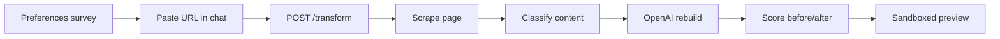

# Ditto — AI Accessibility Browser

Ditto is a full-stack AI accessibility project that rebuilds any webpage around how **you** read, whether you use a screen reader, need dyslexia-friendly typography, want captions and transcripts, or prefer larger text and calmer layouts.

Paste a link, and Ditto scrapes the page, scores its accessibility, and returns a rebuilt HTML version tailored to your needs.

## Portfolio snapshot

| Area | What it shows |
|---|---|
| **Product** | Personalized accessibility layer for arbitrary web pages |
| **Frontend** | Next.js 15 app with onboarding, preferences, chat, batch transforms, output, sharing, and settings |
| **Backend** | FastAPI API with scraping, transform, score, TTS, profile/history, sharing, maps, and agent routes |
| **AI** | OpenAI for transform/chat/scoring and Claude for agent action planning |
| **Distribution** | Web app plus Chrome Manifest V3 extension for one-click active-tab rebuilds |
| **Startup path** | School accessibility wedge documented in [`SCALABILITY_ROADMAP.md`](SCALABILITY_ROADMAP.md) and [`SCHOOL_ACCESSIBILITY_READINESS.md`](SCHOOL_ACCESSIBILITY_READINESS.md) |

For portfolio assets, see [`PORTFOLIO_CASE_STUDY.md`](PORTFOLIO_CASE_STUDY.md), [`DEMO_SCRIPT.md`](DEMO_SCRIPT.md), [`TOMORROW_DEMO_READINESS.md`](TOMORROW_DEMO_READINESS.md), [`DEMO_SAFE_URLS.md`](DEMO_SAFE_URLS.md), [`LINKEDIN_POST_DRAFT.md`](LINKEDIN_POST_DRAFT.md), and [`PORTFOLIO_CHECKLIST.md`](PORTFOLIO_CHECKLIST.md).

## Live demo

Deploy with **[Render](https://render.com)** (recommended full-stack Blueprint) or host the frontend on **Vercel** with a separate backend — see [Deploy](#deploy) below and [`VERCEL_DEPLOYMENT.md`](VERCEL_DEPLOYMENT.md).

| | URL |
|---|---|
| **Frontend** | `https://frontend-tau-two-34.vercel.app` (Vercel frontend, verified public) or `https://ditto-web.onrender.com` (after Blueprint deploy) |
| **Backend API** | Not currently verified live. Render/Cloud Run backend deploy required before setting `NEXT_PUBLIC_BACKEND_URL`. |

## Quick start (local)

### 1. Backend

```bash
python -m venv .venv && source .venv/bin/activate
pip install -r requirements.txt

cp .env.example .env
# Add OPENAI_API_KEY and CLAUDE_API_KEY (required for transform + agent actions)

uvicorn app.main:app --reload --port 8080
```

API docs → http://localhost:8080/docs

### 2. Frontend

```bash
cd frontend
cp .env.example .env.local
npm install
npm run dev
```

App → http://localhost:3000

### 3. Browser extension (optional)

Load `extension/` unpacked in `chrome://extensions` to rebuild the active tab
with one click, no copy-paste required — see [`extension/README.md`](extension/README.md).

## How it works



1. **Preferences** — Tell Ditto how you see, hear, and read best (saved in your browser).
2. **Chat** — Paste any URL or ask Ditto questions. URLs trigger a full rebuild.
3. **Output** — View the rebuilt page with before/after accessibility scores.

**Cost/latency notes:** scraping and scoring the *original* page is cached
per URL (10 min) independent of profile, so rebuilding the same link for a
different profile skips the browser render and one LLM call. Full
results are cached per (URL, profile) for 15 min. Scoring and content
classification run on `OPENAI_LIGHT_MODEL` (a cheaper model) — only the
page rebuild itself uses the full `OPENAI_MODEL`.

## API endpoints

| Method | Path | Description |
|--------|------|-------------|
| GET | `/health` | Liveness + config flags |
| POST | `/transform` | Scrape URL → rebuild HTML for user profile |
| POST | `/transform/batch` | Rebuild up to 10 URLs at once with one profile |
| POST | `/chat` | Conversational Ditto replies (OpenAI) |
| POST | `/voice/tts` | ElevenLabs text-to-speech (MP3) |
| POST | `/classify` | Pre-flight content safety for minors |
| POST | `/score` | Accessibility score without transforming |
| POST | `/save-profile` | Persist profile to Firestore |
| GET | `/get-profile/{uid}` | Load profile from Firestore |
| GET | `/history/{uid}` | Recent transforms for a user (opt-in — see Privacy) |
| GET | `/history/{uid}/report` | Downloadable CSV audit trail of before/after scores |
| GET | `/pilot/privacy-notice` | Plain-language school pilot privacy and consent copy |
| GET | `/pilot/launch-checklist` | Coordinator checklist for launching a school pilot safely |
| GET | `/pilot/success-criteria` | Measurable outcome targets for school pilot evaluation |
| POST | `/pilot/reading-list` | Validate a school pilot reading list without scraping/LLM spend |
| GET | `/pilot/reading-list/{id}` | Fetch an in-memory pilot reading-list scaffold |
| GET | `/pilot/reading-list/{id}/summary` | Get readiness rate, ready/blocked domains, duplicate count, and next step |
| GET | `/pilot/reading-list/{id}/report.csv` | Download coordinator CSV for pilot readiness evidence |
| POST | `/share` | Persist a rebuilt page, returns a short id for `/r/{id}` |
| GET | `/share/{id}` | Fetch a previously shared rebuilt page |

## Project layout

```
frontend/          Next.js 15 app (Ditto UI)
extension/         Manifest V3 browser extension — rebuild the active tab in one click
app/
  main.py          FastAPI entry point
  routers/         HTTP routes (transform, chat, voice, health, …)
  services/        OpenAI, Claude, scraping, scoring, TTS, compliance
  models/          Pydantic request/response schemas
deploy.sh          Deploy backend to Cloud Run
cloudbuild.yaml    CI/CD for Cloud Run
render.yaml        One-click deploy to Render (API + frontend)
```

## Environment variables

See [`.env.example`](.env.example) (backend) and [`frontend/.env.example`](frontend/.env.example) (frontend).

| Variable | Required | Description |
|----------|----------|-------------|
| `OPENAI_API_KEY` | Yes | OpenAI API for transform, chat, scoring |
| `CLAUDE_API_KEY` | Yes | Claude API for agent actions |
| `OPENAI_LIGHT_MODEL` | No | Cheaper model for scoring/classification (default `gpt-4o-mini`) |
| `ELEVENLABS_API_KEY` | No | Text-to-speech (`/voice/tts`) |
| `FIREBASE_PROJECT_ID` | No | Analytics + profile storage |
| `GOOGLE_MAPS_API_KEY` | No | Maps endpoints only |
| `CORS_ORIGINS` | Yes (prod) | Comma-separated frontend origins (auto on Render) |
| `NEXT_PUBLIC_BACKEND_URL` | Yes (prod) | Backend URL for the frontend (auto on Render) |

> Scraping uses **Playwright** bundled in the Docker image.

## Deploy

### Render (recommended — one-click)

1. Push this repo to GitHub.
2. In [Render](https://dashboard.render.com) → **New** → **Blueprint**.
3. Connect the repo — Render reads [`render.yaml`](render.yaml).
4. When prompted, set **`OPENAI_API_KEY`** and **`CLAUDE_API_KEY`**.
5. Deploy. Render wires `NEXT_PUBLIC_BACKEND_URL` and `CORS_ORIGINS` automatically.

| Service | Plan | Why |
|---------|------|-----|
| `ditto-api` | **Starter** ($7/mo) | Playwright needs ~1 GB RAM; free tier often OOMs |
| `ditto-web` | Free | Next.js frontend |

Optional env vars (set in Render dashboard → `ditto-api` → Environment):

| Variable | Required | Get it from |
|----------|----------|-------------|
| `OPENAI_API_KEY` | **Yes** | OpenAI dashboard |
| `CLAUDE_API_KEY` | **Yes** | Anthropic Console |
| `ELEVENLABS_API_KEY` | No | [elevenlabs.io](https://elevenlabs.io) → Profile → API Key |
| `FIREBASE_PROJECT_ID` | No | Firebase console |
| `GOOGLE_MAPS_API_KEY` | No | Google Cloud Console (unused by UI) |

**Cold starts:** Free/starter services spin down after inactivity. First request may take 30–60s.

### Backend (Cloud Run)

```bash
# Set CORS_ORIGINS to your Vercel URL before deploying
CORS_ORIGINS=https://your-app.vercel.app ./deploy.sh your-gcp-project-id
```

### Frontend (Vercel)

1. Import the `frontend/` directory in Vercel.
2. Set `NEXT_PUBLIC_BACKEND_URL` to your Cloud Run URL.
3. Deploy.

## Development

For startup-readiness follow-up, see [`SCALABILITY_ROADMAP.md`](SCALABILITY_ROADMAP.md).
For a recruiter/founder-facing walkthrough and demo script, see [`PORTFOLIO_CASE_STUDY.md`](PORTFOLIO_CASE_STUDY.md).
For the first fundable pilot wedge, see [`SCHOOL_ACCESSIBILITY_READINESS.md`](SCHOOL_ACCESSIBILITY_READINESS.md).

```bash
# Backend tests
pytest

# Frontend typecheck + lint
cd frontend && npm run typecheck && npm run lint
```

## Privacy

- Preferences are stored in **localStorage** in your browser.
- When you transform a page, Ditto sends the **URL** (and your accessibility profile) to the backend. We do not store your browsing history by default.
- Optional Firestore logging records transform metadata for analytics.
- If you turn on **"Remember my recent pages"** in preferences, Ditto stores a per-device history entry (URL, disability profile, timestamp) in Firestore under a random client ID, so you can revisit past rebuilds from the chat screen.
- Clicking **"Create share link"** on the output page publishes the rebuilt HTML (not your profile) to a public, unlisted URL (`/r/{id}`) that anyone with the link can view.

## License

MIT
